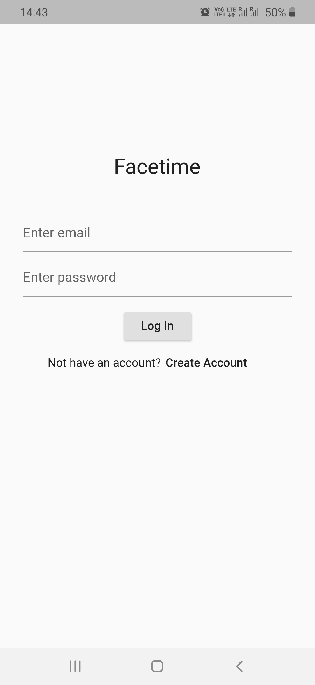

# facetime

Flutter videocall application using agora sdk and firestore.
Plays ringtone when call arrives and also inform user through notification when app is killed or minimized. Visit issues section to see preview of app.

#Snapshots

#Functionality 

-search user

-send friend request

-handle notification (background and foreground)

-video call with friend 

-call history and friends list

#Bug

-When application is minimized and new call arrives sometimes not stopping the call ringtone after responding to call
## Getting Started

This project is a starting point for a Flutter application.

A few resources to get you started if this is your first Flutter project:

- [Lab: Write your first Flutter app](https://flutter.dev/docs/get-started/codelab)
- [Cookbook: Useful Flutter samples](https://flutter.dev/docs/cookbook)

For help getting started with Flutter, view our
[online documentation](https://flutter.dev/docs), which offers tutorials,
samples, guidance on mobile development, and a full API reference.
